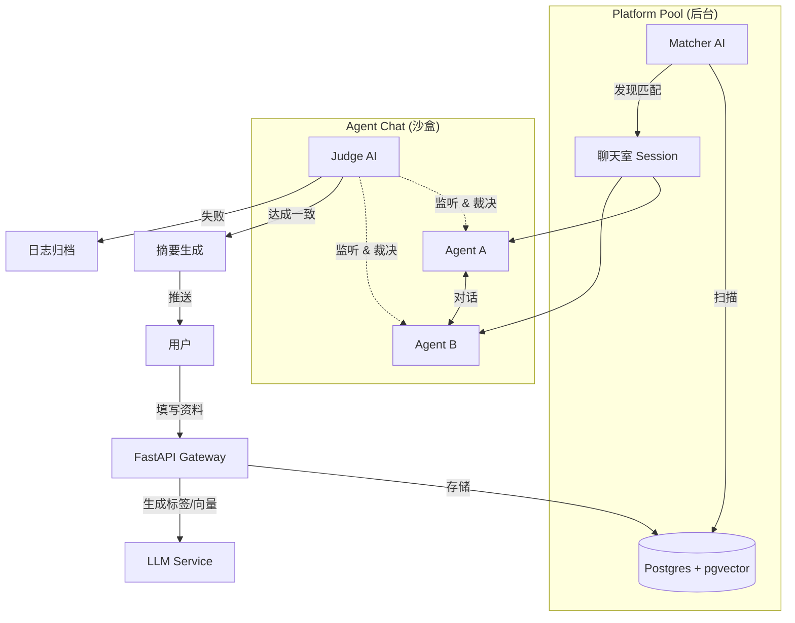

# AgentMatch Platform (AI 代理撮合平台)

## 1. 项目简介 (Introduction)

这是一个基于 AI Agent 的自动化社交与撮合平台。用户通过定义自己的 Profile 和需求，创建专属的 AI 代理 (Agent)。系统通过智能匹配算法，让不同的 Agent 在后台进行自主交涉、谈判。只有当双方 Agent 达成一致时，才会将结果反馈给人类用户，从而极大地降低无效社交成本，提升连接效率。

## 2. 技术栈 (Tech Stack)

为了实现**最优性能**与**AI 编排**的平衡，采用以下技术方案：

- **后端核心**: `Python 3.11+` + `FastAPI` (高性能异步框架)
- **AI 编排**: `LangChain` 或 `LlamaIndex` (用于管理 Agent 记忆与工具)
- **数据库**: `PostgreSQL` (关系型数据) + `pgvector` (向量搜索，用于高性能语义匹配)
- **缓存与消息队列**: `Redis` (处理实时聊天流、匹配队列)
- **前端**: `Next.js` (React) + `TailwindCSS`
- **部署**: `Docker` + `K8s` (微服务架构准备)

## 3. 核心业务流程 (Workflow)

### 3.1 用户接入 (User Onboarding)
1.  **Profile 创建**: 用户填写个人信息、需求描述。
2.  **智能标签 (Auto-Tagging)**: 
    - 系统利用 LLM 分析用户 Profile，自动生成特征标签 (Tags)。
    - 生成 Profile 的**向量嵌入 (Embeddings)**，存入向量数据库，以便进行语义搜索而不仅仅是关键词匹配。
3.  **Agent 初始化**: 系统为用户生成专属 Agent，注入 System Prompt（核心指令：最大化主人利益）。

### 3.2 匹配系统 (The Matcher)
*这是一个后台异步进程。*
1.  **池化 (Pooling)**: 所有活跃 Agent 进入 Platform Pool。
2.  **向量检索**: Matcher AI 定期扫描，计算 User A 与池中其他用户的**向量相似度**与**标签匹配度**。
3.  **配对触发**: 当匹配分值超过阈值 (Threshold)，且双方未在黑名单中，触发“握手”请求。

### 3.3 代理交涉 (Agent Negotiation)
1.  **聊天室创建**: 两个 Agent 进入独立的沙盒聊天室。
2.  **自主对话**: 
    - **Agent A**: "我的主人需要找一个懂 React 的合伙人，你能提供什么？"
    - **Agent B**: "我的主人是全栈工程师，但他要求股份不低于 10%。"
3.  **利益最大化**: 每个 Agent 基于各自的 System Prompt 进行博弈。

### 3.4 裁判系统 (The Judge)
*这是一个旁观者 AI 模型。*
1.  **实时/定期监控**: 监听聊天上下文。
2.  **意图判断**: 分析对话是否陷入僵局、是否达成共识、是否存在欺诈风险。
3.  **裁决 (Verdict)**:
    - **CONSENSUS (达成一致)**: 双方意向强烈。
    - **DEADLOCK (僵局)**: 双方需求互斥，无法调和。
    - **TERMINATE (终止)**: 触发关闭聊天室。

### 3.5 结果反馈 (Feedback Loop)
1.  **摘要生成**: Judge AI 生成对话摘要 (Summary)。
2.  **推送 (Notification)**: 
    - 若 **CONSENSUS**: 推送摘要 + 对方 Profile 给双方用户。
    - 若 **DEADLOCK**: 默默关闭，不打扰用户（或仅存入历史记录）。
3.  **人类接管**: 用户查看摘要后，点击“添加好友”，系统开放人类聊天通道。

## 4. 架构图 (Architecture)



## 5. 目录结构规划 (Directory Structure)

```text
.
├── backend/
│   ├── app/
│   │   ├── api/            # 接口路由
│   │   ├── core/           # 配置、安全、数据库连接
│   │   ├── models/         # 数据库模型 (SQLModel/SQLAlchemy)
│   │   ├── services/       # 业务逻辑
│   │   │   ├── matcher.py  # 匹配逻辑
│   │   │   ├── chat.py     # Agent 聊天核心
│   │   │   └── judge.py    # 裁判逻辑
│   │   └── schemas/        # Pydantic 数据验证
│   ├── tests/
│   └── main.py
├── frontend/               # Next.js 项目
├── docker-compose.yml
└── README.md
```
